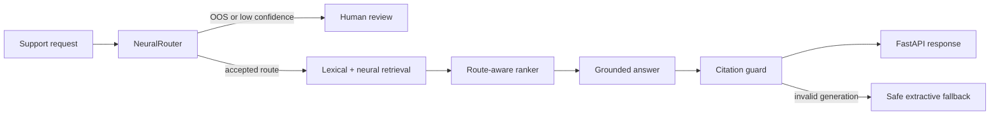

# ResolveAI

**Confidence-aware support intelligence: classify a request, abstain when it is
unsafe to guess, retrieve grounded evidence, and serve the result through a
tested API.**

ResolveAI is one product composed of three portfolio-grade ML projects. It uses
only Python, NumPy, pandas, PyTorch, FastAPI, and an optional C++17 extension.
There is no hidden model API in the measured path and no scikit-learn,
Transformers, vector database, or orchestration framework.

## Measured Results

All model results use the untouched CLINC150 test split: 4,500 in-scope and
1,000 out-of-scope (OOS) requests across 150 intents. Knowledge documents and
vocabulary statistics are derived from the training split only.

| System | In-scope accuracy | Macro F1 (151 classes) | OOS F1 | ECE |
|---|---:|---:|---:|---:|
| NumPy Multinomial NB | 83.22% | 80.26% | 50.98% | 3.48% |
| Calibrated PyTorch router | **86.80%** | **86.25%** | **69.51%** | **1.37%** |

| Retriever | Recall@1 | Recall@3 | MRR |
|---|---:|---:|---:|
| Lexical TF-IDF | 72.64% | 87.96% | 81.05% |
| Neural | 81.58% | 91.82% | 87.33% |
| Hybrid | 81.31% | 92.80% | 87.49% |
| Route-aware hybrid | **88.11%** | **94.84%** | **91.75%** |

End-to-end CPU benchmark over 500 sequential mixed requests: **2.15 ms p50**,
**4.06 ms p95**, **424.8 requests/second**, and **100% citation coverage on
resolved requests**. See the versioned JSON reports under [`artifacts/`](artifacts/).

## Three Connected Projects

### 1. IntentBench: classical ML and evaluation

- Strict pandas dataset contracts validate 23,700 rows, label sets, split sizes,
  content hashes, duplicates, and license metadata.
- A from-scratch NumPy Multinomial Naive Bayes classifier establishes a real
  baseline across 151 classes.
- Shared evaluation measures accuracy, macro precision/recall/F1, OOS
  precision/recall/F1, NLL, expected calibration error, coverage, confusions,
  and latency.

### 2. NeuralRouter: deep learning and uncertainty

- A compact 475,671-parameter PyTorch encoder uses learned token embeddings,
  masked mean/max pooling, and an MLP classifier.
- Deterministic training, early stopping, validation-only temperature scaling,
  and confidence threshold selection produce versioned inference artifacts.
- Low-confidence and explicit OOS requests abstain instead of being forced into
  a support intent.

### 3. GroundedAssist: retrieval and production serving

- Training-only knowledge construction feeds lexical TF-IDF and learned neural
  retrieval; routing is a small third signal in the final ranker.
- Citation validation rejects uncited or unknown-source LLM output and falls
  back to a deterministic grounded response.
- Typed FastAPI endpoints expose routing, assistance, model metadata, health,
  feedback, and OpenMetrics-compatible counters.
- An optional C++17 top-k backend is connected through a C ABI and `ctypes`,
  with exact parity tests. NumPy remains the default because BLAS is faster at
  this workload size; the benchmark records that result rather than hiding it.



## Quick Start

Prerequisites: Linux, Python 3.11-3.13, and `g++` for the optional native path.

```bash
./setup.sh
.venv/bin/resolveai download-data
.venv/bin/resolveai train-all
make cpp test
.venv/bin/resolveai demo --text "please help me find the phone i lost"
.venv/bin/resolveai serve
```

Open `http://127.0.0.1:8000/docs` for the generated OpenAPI interface.

To reproduce individual stages:

```bash
make baseline       # IntentBench
make neural         # NeuralRouter
make index evaluate # GroundedAssist retrieval
make benchmark      # full serving pipeline
make benchmark-native
```

## API

```bash
curl -sS http://127.0.0.1:8000/health

curl -sS http://127.0.0.1:8000/v1/assist \
  -H 'Content-Type: application/json' \
  -d '{"text":"please help me find the phone i lost","top_k":3}'
```

An OOS request returns `needs_human_review` with no evidence or invented answer.
The default generator is deterministic and offline. An optional
chat-completions-compatible model can be enabled per request after setting:

```bash
export RESOLVEAI_LLM_BASE_URL="https://provider.example/v1"
export RESOLVEAI_LLM_API_KEY="..."
export RESOLVEAI_LLM_MODEL="..."
```

No provider SDK is required. Invalid, uncited, or unreachable LLM output uses
the citation-bearing extractive fallback.

## Repository Map

| Path | Responsibility |
|---|---|
| `src/resolveai/data.py` | download, schema validation, lineage report |
| `src/resolveai/baseline.py` | NumPy classical baseline |
| `src/resolveai/neural.py` | PyTorch training and inference |
| `src/resolveai/retrieval.py` | TF-IDF, neural index, ranker, C++ bridge |
| `src/resolveai/rag.py` | optional generation and citation guard |
| `src/resolveai/service.py` | orchestration, feedback, metrics, benchmarks |
| `src/resolveai/api.py` | typed FastAPI contract |
| `cpp/topk.cpp` | optional native top-k implementation |
| `tests/` | unit, API, parity, and real-artifact integration tests |
| `docs/` | architecture, model card, interview guide, and learning plan |

## Engineering Guarantees

- No test examples are used to build the vocabulary, model, knowledge base, or
  retrieval index.
- Thresholds and temperature are selected on validation data only.
- Model and index hashes are returned by `/v1/model-info`.
- Feedback stores only trace ID, rating, optional corrected intent, and time;
  raw user text is not persisted.
- All claimed numbers are generated by CLI commands and retained as JSON.
- CI builds the C++ library, runs 18 tests, and smoke-tests the CLI.

## Documentation

- [Architecture](docs/ARCHITECTURE.md)
- [Model card](docs/MODEL_CARD.md)
- [API contract](docs/API.md)
- [Ten-day learning plan](docs/10_DAY_PLAN.md)
- [Interview and project pitch guide](docs/INTERVIEW_GUIDE.md)
- [Security and privacy notes](SECURITY.md)

## Scope and Limitations

CLINC150 is a benchmark of short English intent queries, not a real company's
support traffic. The generated knowledge base is a retrieval evaluation corpus,
not operational policy. OOS detection is imperfect, so the system demonstrates
an explicit abstention mechanism rather than claiming safety. Before production
use, replace the corpus, define cost-based thresholds, add authentication and
rate limiting, run load tests with concurrency, and monitor drift by traffic
segment.

Code is MIT licensed. CLINC150-derived data and knowledge artifacts retain the
dataset's CC BY 3.0 terms and attribution; see [`data/DATASET.md`](data/DATASET.md).
